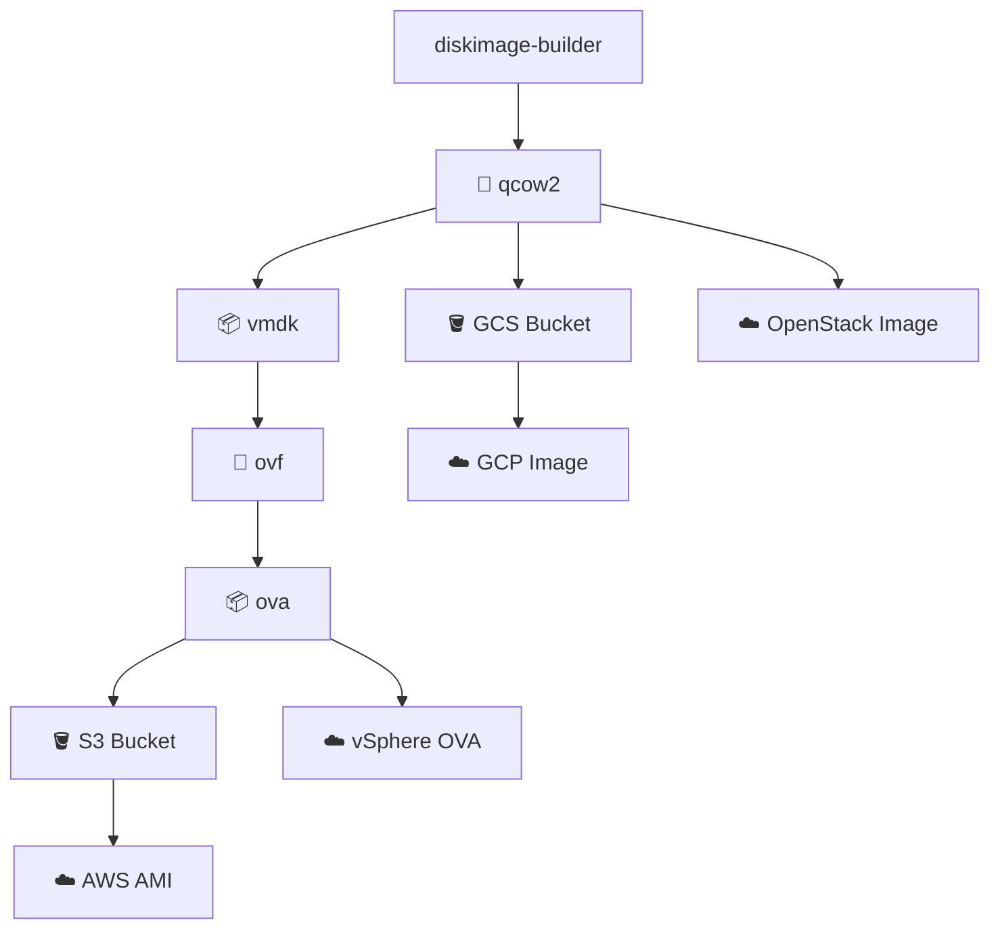

# DIB7 - Disk Image Builder v7

[](LICENSE)
[](https://ansible.com/)

DIB7 is an automated pipeline for building and deploying virtual machine disk
images across multiple cloud platforms using Ansible and diskimage-builder (DIB).

## Overview

DIB7 streamlines the entire lifecycle of VM image creation and deployment:

- **Build**: Create base QCOW2 images using diskimage-builder
- **Convert**: Transform images to platform-specific formats (OVA)
- **Deploy**: Import and publish images to AWS, GCP, OpenStack and VMware vSphere

## Architecture



## Supported Platforms

### Cloud Providers

- **AWS** - AMI import via S3 and VM Import/Export
- **GCP** - Compute Engine images via Cloud Storage (GCS)
- **OpenStack** - Glance images via direct upload
- **VMware vSphere** - Content Library OVA deployment

### Operating Systems by Provider

- Ubuntu (16.04, 18.04, 20.04, 22.04, 23.04, 24.04, 26.04)
- CentOS/RHEL (8.x, 9.x, 10)
- Fedora (37, 38, 39)
- Debian (10, 11, 12.x)
- Amazon Linux (2, 2023)
- Rocky Linux (9.x, 10)
- Oracle Linux (8.x-10.x)
- SUSE Linux Enterprise (11, 12, 15)

### DIB-Supported Operating Systems (Targets)

- Debian
- Ubuntu
- Fedora
- Red Hat Enterprise Linux (RHEL)
- CentOS
- openSUSE
- Gentoo

## Quick Start

### Prerequisites

1. **Python Environment**

   ```bash
   sudo apt update
   sudo apt install -y python3 python3-venv python3-pip git
   python3 -m venv ~/venvs/dib
   source ~/venvs/dib/bin/activate
   pip install diskimage-builder
   ```

2. **Ansible Collections**

   ```bash
   ansible-galaxy collection install \
     amazon.aws \
     community.vmware \
     google.cloud \
     openstack.cloud
   ```

3. **System Dependencies**

   ```bash
   sudo apt install -y qemu-utils kpartx debootstrap parted dosfstools gdisk squashfs-tools
   ```

### Basic Usage

1. **Configure Vaults** (see [Vault Configuration](#vault-configuration))

2. **Build Base Image**

   ```bash
   # Build all hosts in the inventory
   ansible-playbook playbooks/build-qcow2.yml

   # Build a specific host
   ansible-playbook playbooks/build-qcow2.yml -l ubuntu24044

   # Build all hosts in a group
   ansible-playbook playbooks/build-qcow2.yml -l ubuntu
   ```

   Omit `-l` to run against every host in `hosts.yml`. Use `-l` only when you
   want to limit the run to a specific host or inventory group.

3. **Deploy to Target Platform**

   **AWS:**

   ```bash
   ansible-playbook playbooks/convert-qcow2-to-ova.yml -l <host-or-group> --ask-vault-pass
   ansible-playbook playbooks/import-ova-aws.yml -l <host-or-group> --ask-vault-pass
   ```

   **GCP:**

   ```bash
   ansible-playbook playbooks/import-qcow2-gcp.yml -l <host-or-group> --ask-vault-pass
   ```

   **OpenStack:**

   ```bash
   ansible-playbook playbooks/import-qcow2-openstack.yml -l <host-or-group> --ask-vault-pass
   ```

   **vSphere:**

   ```bash
   ansible-playbook playbooks/convert-qcow2-to-ova.yml -l <host-or-group> --ask-vault-pass
   ansible-playbook playbooks/import-ova-vsphere.yml -l <host-or-group> --ask-vault-pass
   ```

## Project Structure

```bash
dib7/
├── ansible.cfg                 # Ansible configuration
├── bin/                        # Utility scripts
│   ├── import-ova-vsphere.ps1  # PowerShell vSphere import script
│   ├── inspect-qcow2.sh        # Script for examining and modifying virtual machines
│   └── *-vault.sh              # Vault management scripts
├── doc/                        # Documentation
├── elements/                   # DIB elements for custom OS configurations
├── group_vars/                 # Ansible group variables
├── hosts.yml                   # Inventory file
├── playbooks/                  # Ansible playbooks
├── templates/                  # Jinja2 templates
└── vaults/                     # Encrypted credentials
```

## Documentation

- `doc/adding-distros-and-releases.md` - how to add a new distro family or a new version of an existing distro
- `doc/group-vars-all.md` - defaults shared by all builds
- `doc/group-vars-distro.md` - per-distro variables and differences
- `doc/playbooks-overview.md` - what each playbook does and when to run it

## Playbooks

|Playbook|Purpose|Dependencies|
|--------|-------|------------|
|`build-qcow2.yml`|Build base QCOW2 image|diskimage-builder|
|`convert-qcow2-to-ova.yml`|Convert QCOW2 to OVA|qemu-img, ovftool|
|`import-ova-aws.yml`|Upload OVA to S3, import to AWS AMI|AWS CLI, S3, VM Import|
|`import-ova-vsphere.yml`|Import OVA to vSphere|pwsh, PowerCLI|
|`import-qcow2-gcp.yml`|Import QCOW2 to GCP|gcloud, gsutil|
|`import-qcow2-openstack.yml`|Import QCOW2 to OpenStack|OpenStack CLI|

## Vault Configuration

DIB7 uses Ansible Vault for secure credential management. Create encrypted
vault files:

### AWS Vault (`vaults/aws.yml`)

```yaml
aws_region: "my-region"
s3_bucket: "my-bucket"
vmimport_role_name: "vmimport-role"
```

### GCP Vault (`vaults/gcp.yml`)

```yaml
gcp_project: "my-project"
gcs_bucket: "my-image-bucket"
gcs_location: "my-location"
service_account_key: |
  {
    "type": "service_account",
    ...
  }
```

### OpenStack Vault (`vaults/openstack.yml`)

```yaml
openstack_auth:
  auth_url: "https://keystone.example.com:5000/v3"
  username: "my-username"
  password: "my-password"
  project_name: "my-project"
  user_domain_name: "Default"
  project_domain_name: "Default"
```

### vSphere Vault (`vaults/vsphere.yml`)

```yaml
vcenter_hostname: "vcenter.example.com"
vcenter_username: "administrator@vsphere.local"
vcenter_password: "secure-password"
vsphere_content_library: "my-content-library"
```

## Custom Elements

DIB7 includes custom diskimage-builder elements for supported operating systems:

- `elements/custom-centos10stream/` - CentOS Stream 10 customizations
- `elements/custom-debian/` - Debian customizations
- `elements/custom-fedora/` - Fedora customizations
- `elements/custom-ubuntu/` - Ubuntu customizations

Each element directory can contain standard diskimage-builder phase
subdirectories. Common phases include:

- `pre-install.d/` - Pre-installation setup
- `install.d/` - Package installation
- `post-install.d/` - Post-installation configuration
- `finalise.d/` - Image finalization

See [doc/phases.md](doc/phases.md) for the complete ordered list of DIB phases
and whether each phase runs inside or outside the chroot.

## Variables

### Global Variables (`group_vars/all/main.yml`)

- `image_arch`: CPU architecture (default: `amd64`)
- `image_name`: Image base name (default: `{{ inventory_hostname }}-base`)
- `image_size`: Image size in GB (default: `35`)
- `image_type`: Image format (default: `qcow2`)
- `qcow2_file`, `vmdk_file`, `ovf_file`, `ova_file`, `mf_file`: Derived output filenames
- `dpkg_opts`, `debian_frontend`, `needrestart_mode`: Debian/Ubuntu packaging options

### OS-Specific Variables

- `group_vars/centos10stream/main.yml`
- `group_vars/debian/main.yml`
- `group_vars/fedora/main.yml`
- `group_vars/ubuntu/main.yml`

## Development

### Testing Image Builds

```bash
# Test basic DIB functionality
export DIB_RELEASE=noble
disk-image-create ubuntu vm -o test-ubuntu

# Inspect QCOW2 contents
./bin/inspect-qcow2.sh test-ubuntu.qcow2
```

### Adding New OS Support

1. Create custom element in `elements/`
2. Add group variables in `group_vars/`
3. Update documentation in `doc/`

For a full walkthrough, including how to add a new release of an existing
distro such as Ubuntu `26.04`, see
`doc/adding-distros-and-releases.md`.

## Troubleshooting

### Common Issues

1. **DIB Build Failures**
   - Ensure all system dependencies are installed
   - Check available disk space (>50GB recommended)
   - Verify Python virtual environment is activated

2. **Cloud Import Failures**
   - Validate vault credentials
   - Check cloud provider quotas and permissions
   - Review cloud provider import logs

3. **Ansible Collection Issues**
   - Update collections: `ansible-galaxy collection install --force <collection>`
   - Check collection compatibility with Ansible version

### Debug Mode

Run playbooks with verbose output:

```bash
ansible-playbook playbooks/build-qcow2.yml -vvv
```

## Contributing

1. Fork the repository
2. Create a feature branch
3. Make changes with proper documentation
4. Test thoroughly across all supported platforms
5. Submit a pull request

## License

This project is licensed under the MIT License - see the LICENSE file for details.

## Support

For issues and questions:

- Check existing documentation in `doc/`
- Review Ansible playbook logs
- Validate cloud provider service status
- Create an issue with detailed error logs and configuration
