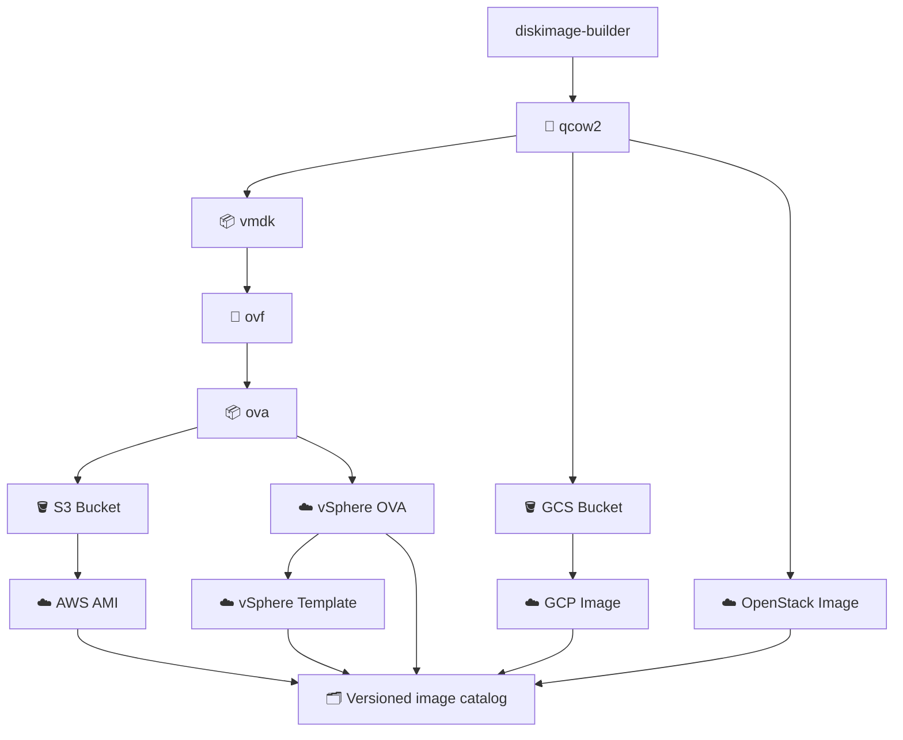

# DIB7 - Disk Image Builder v7

[](LICENSE)
[](https://ansible.com/)

DIB7 is an automated pipeline for building and deploying virtual machine disk
images across multiple cloud platforms using Ansible and diskimage-builder (DIB).

## Overview

DIB7 streamlines the entire lifecycle of VM image creation and deployment:

- **Build**: Create base QCOW2 images using diskimage-builder
- **Convert**: Transform images to platform-specific formats (OVA)
- **Deploy**: Import and publish images to AWS, GCP, OpenStack and VMware vSphere

## Architecture


```mermaid
flowchart TB
    DIB["diskimage-builder"] --> QCOW2["💽 qcow2"]
    QCOW2 --> VMDK["📦 vmdk"]
    VMDK --> OVF["📄 ovf"]
    OVF --> OVA["📦 ova"]
    QCOW2 --> GCS["🪣 GCS Bucket"]
    GCS --> GCP_IMG["☁️ GCP Image"]
    QCOW2 --> OPENSTACK_IMG["☁️ OpenStack Image"]
    OVA --> S3["🪣 S3 Bucket"]
    S3 --> AWS_IMG["☁️ AWS AMI"]
    OVA --> VSPHERE_IMG["☁️ vSphere OVA"]
    VSPHERE_IMG --> VSPHERE_TPL["☁️ vSphere Template"]
    AWS_IMG --> CATALOG["🗂️ Versioned image catalog"]
    GCP_IMG --> CATALOG
    OPENSTACK_IMG --> CATALOG
    VSPHERE_IMG --> CATALOG
    VSPHERE_TPL --> CATALOG
```

## Supported Platforms

### Cloud Providers

- **AWS** - AMI import via S3 and VM Import/Export
- **GCP** - Compute Engine images via Cloud Storage (GCS)
- **OpenStack** - Glance images via direct upload
- **VMware vSphere** - Content Library OVA deployment and vSphere template creation

### Operating Systems by Provider

Validated against provider documentation on 2026-07-28. See the provider-specific
pages in `doc/` for release and known-issue details. Provider support is
separate from DIB7 inventory support; re-check the provider matrix before
enabling a new target release.

Source documents checked:
[AWS VM Import/Export requirements](https://docs.aws.amazon.com/vm-import/latest/userguide/prerequisites.html),
[GCP Migrate to Virtual Machines supported operating systems](https://cloud.google.com/migrate/virtual-machines/docs/5.0/discover/supported-os-versions),
[OpenStack Glance project reference](https://governance.openstack.org/tc/reference/projects/glance.html),
and the
[VMware Guest OS Installation Guide](https://partnerweb.vmware.com/GOSIG/home.html).

#### AWS VM Import/Export

Current provider-supported operating systems:

- Amazon Linux 2 and 2023
- Ubuntu through 26.04
- Debian 11 and selected Debian 12 releases through 12.7
- Fedora 41-43
- CentOS Stream 9
- RHEL, Rocky Linux, and Oracle Linux through 10.1
- SLES 15 SP1-SP6
- Older CentOS, Fedora, SLES 11, and SLES 12 releases are EOL even where
  still listed by AWS
- Windows Server through 2025

DIB7 target notes: `ubuntu24044` matches AWS import support, and
`ubuntu26041` matches the published kernel matrix but currently encounters an
AWS-side injection failure; see [doc/aws-supported-images.md](doc/aws-supported-images.md).
`rocky102` is covered only when its resulting point release is no newer than
10.1; verify the cloud image point release before importing. `debian1215`,
`debian1306`, `fedora44`, and `centos10s` are not listed for AWS VM Import/Export.

#### GCP Compute Engine Image Import

Current provider-supported operating systems:

- Ubuntu 22.04, 24.04, and 26.04
- Debian 11.0-11.7, 12.0-12.10, and 13.0-13.2
- CentOS Stream 9 and 10
- RHEL 7.9, 8.0-8.10, 9.0-9.7, and 10.0-10.2
- Rocky Linux 8.4-8.10, 9.0-9.7, and 10.0-10.1
- AlmaLinux 8.3-8.10, 9.0-9.8, and 10.0-10.2
- SLES 12 SP5, 15 SP5-SP7, and 16
- Windows Server through 2025

DIB7 target notes: `ubuntu24044`, `ubuntu26041`, `debian1306`, and `centos10s`
match the current GCP import matrix. Fedora Server is not listed as a supported
import target.

#### OpenStack Glance

No provider-wide OS version list. Glance stores and serves bootable disk
images; guest support depends on the cloud operator, Nova hypervisor, image
metadata, and local policy.

DIB7 uploads QCOW2 images directly. Validate each target against the
destination cloud's image policy and compute driver.

#### VMware vSphere

The guest OS guide lists Debian 13, Ubuntu through 25.10, RHEL 10, Rocky
Linux 10, Oracle Linux 10, AlmaLinux 10, SLES 16, Amazon Linux 2, and Windows
Server 2025. Fedora support is limited to older Fedora desktop entries in the
VMware guide.

DIB7 can deploy OVA files, but newer targets may need the closest supported
`vm_os_type` guest ID until VMware exposes an exact ID.

### Configured DIB7 Operating System Targets

- CentOS Stream 10
- Debian 12 (Bookworm)
- Debian 13 (Trixie)
- Fedora 44
- Rocky Linux 10
- Ubuntu 24.04 LTS (Noble)
- Ubuntu 26.04 LTS (Resolute)

### Upstream diskimage-builder Operating System Elements

- Debian
- Ubuntu
- Fedora
- Red Hat Enterprise Linux (RHEL)
- CentOS
- openSUSE
- Gentoo

The import playbooks publish provider-specific artifact IDs to a versioned image
catalog. See [doc/image-catalog.md](doc/image-catalog.md) for the Terraform
hand-off.

## Quick Start

### Prerequisites

1. **Python Environment**

   ansible-core 2.18 requires Python 3.11 or newer on the control node.

   ```bash
   sudo apt update
   sudo apt install -y python3 python3-venv python3-pip git
   python3 --version   # must report 3.11 or newer
   python3 -m venv ~/.dib7
   ```

   `~/.dib7` is the single virtualenv for the whole project — every distro
   builds from it. See
   [doc/python3-virtualenv.md](doc/python3-virtualenv.md).

2. **Pinned Ansible/Python dependencies**

   ```bash
   ~/.dib7/bin/python3 -m pip install -r requirements.txt
   ~/.dib7/bin/ansible-galaxy collection install -r requirements.yml
   ```

   Install via `~/.dib7/bin/python3 -m pip` rather than `~/.dib7/bin/pip` — the
   interpreter path is what activates the venv and sets the shebangs on the
   installed console scripts.

   Fedora builds additionally need a patched `diskimage-builder` element,
   applied from the project root:

   <!-- markdownlint-disable MD013 -->

   ```bash
   DIB7_SITE=$(~/.dib7/bin/python3 -c "import site; print(site.getsitepackages()[0])")
   patch -b -d "$DIB7_SITE/diskimage_builder/elements/fedora/root.d" \
         < patches/diskimage-builder-3.42.0-fedora-generic-image.patch
   ```

   <!-- markdownlint-enable MD013 -->

   The patch touches only the `fedora` element, so it is inert for the other
   builds sharing the venv. See [doc/fedora.md](doc/fedora.md).

   `requirements.txt` includes `diskimage-builder`, `ansible-core`, `PyYAML`,
   and the controller-side Python SDKs required by the AWS, GCP, and
   OpenStack playbooks. The project is validated with ansible-core 2.18.18.
   Keep the collection versions in `requirements.yml` aligned with that core
   version — `amazon.aws` 11.x in particular requires ansible-core 2.17 or
   newer.

3. **System Dependencies**

   ```bash
   sudo apt install -y qemu-utils kpartx debootstrap parted dosfstools gdisk squashfs-tools libguestfs-tools lvm2
   ```

   `ovftool`, PowerShell with PowerCLI, and the Google Cloud CLI (`gcloud`) are
   installed separately and are required by the conversion, vSphere, and GCP
   workflows respectively. See the playbook dependency list below.

### Basic Usage

For a multi-stage run, create one run ID and pass it to every stage so the
stamp gates can detect artifacts left by an earlier run:

```bash
RUN_ID=$(date +%s)
~/.dib7/bin/ansible-playbook -e "run_id=$RUN_ID" playbooks/build-qcow2.yml
~/.dib7/bin/ansible-playbook -e "run_id=$RUN_ID" playbooks/convert-qcow2-to-ova.yml
```

A manually driven stage without `run_id` still requires the preceding stamp and
uses the run recorded in that stamp for catalog versioning. The commands below
assume `RUN_ID` remains set; include `-e "run_id=$RUN_ID"` on each build,
conversion, and import invocation. A manually driven invocation can nevertheless
consume an older artifact if that old stamp remains, so use one run ID for a
release pipeline.

1. **Configure Vaults** (see [Vault Configuration](#vault-configuration))

2. **Build Base Image**

   ```bash
   # Build all hosts in the inventory
   ~/.dib7/bin/ansible-playbook playbooks/build-qcow2.yml

   # Build a specific host
   ~/.dib7/bin/ansible-playbook playbooks/build-qcow2.yml -l ubuntu24044

   # Build all hosts in a group
   ~/.dib7/bin/ansible-playbook playbooks/build-qcow2.yml -l ubuntu
   ```

   Omit `-l` to run against every host in `hosts.yml`. Use `-l` only when you
   want to limit the run to a specific host or inventory group.

3. **Deploy to Target Platform**

   **AWS:**

   ```bash
   ~/.dib7/bin/ansible-playbook playbooks/convert-qcow2-to-ova.yml -l <host-or-group> --ask-vault-pass
   ~/.dib7/bin/ansible-playbook playbooks/import-ova-aws.yml -l <host-or-group> --ask-vault-pass
   ```

   **GCP:**

   ```bash
   ~/.dib7/bin/ansible-playbook playbooks/import-qcow2-gcp.yml -l <host-or-group> --ask-vault-pass
   ```

   **OpenStack:**

   ```bash
   ~/.dib7/bin/ansible-playbook playbooks/import-qcow2-openstack.yml -l <host-or-group> --ask-vault-pass
   ```

   **vSphere:**

   `import-ova-vsphere.yml` and `import-ova-vsphere-template.yml` are
   alternatives, not a chain — each independently uploads the OVA, so only run
   the one(s) you actually need.

   ```bash
   # vSphere OVA (content library item) only
   ~/.dib7/bin/ansible-playbook playbooks/convert-qcow2-to-ova.yml -l <host-or-group> --ask-vault-pass
   ~/.dib7/bin/ansible-playbook playbooks/import-ova-vsphere.yml -l <host-or-group> --ask-vault-pass

   # vSphere Template instead
   ~/.dib7/bin/ansible-playbook playbooks/convert-qcow2-to-ova.yml -l <host-or-group> --ask-vault-pass
   ~/.dib7/bin/ansible-playbook playbooks/import-ova-vsphere-template.yml \
     -l <host-or-group> --ask-vault-pass
   ```

## Project Structure

```bash
dib7/
├── ansible.cfg                 # Ansible configuration
├── bin/                        # Utility scripts
│   ├── import-ova-vsphere.ps1  # PowerShell vSphere import script
│   ├── import-ova-vsphere-template.ps1  # PowerShell template import script
│   ├── publish-image-catalog.py # Catalog publisher
│   ├── reconcile-catalog-aws.py # Marks catalog AMIs retired if gone from AWS
│   ├── inspect-qcow2.sh        # Script for examining and modifying virtual machines
│   └── *-vault.sh              # Vault management scripts
├── block-device-config/       # DIB EFI/GPT block-device layouts
├── catalogs/                   # Versioned provider artifact catalog and schema
├── doc/                        # Documentation
├── elements/                   # DIB elements for custom OS configurations
├── group_vars/                 # Ansible group variables
├── hosts.yml                   # Inventory file
├── patches/                    # Patches applied to the venv (see doc/fedora.md)
├── playbooks/                  # Ansible playbooks
├── requirements.txt            # Pinned Python dependencies
├── requirements.yml            # Pinned Ansible collections
├── templates/                  # Jinja2 templates
├── tests/                     # Syntax and data validation
└── vaults/                     # Encrypted credentials
```

## Documentation

- `doc/adding-distros-and-releases.md` - how to add a new distro family or a
  new version of an existing distro
- `doc/ansible-galaxy.md` - installing and verifying the Ansible Galaxy
  collections used by DIB7
- `doc/aws-supported-images.md` - AWS VM Import/Export Linux distribution support
- `doc/fedora.md` - diskimage-builder patch required to build Fedora Server 43+
- `doc/gcloud.md` - installing the Google Cloud CLI (`gcloud`)
- `doc/gcp-supported-images.md` - GCP Compute Engine Linux distribution support
- `doc/group-vars-all.md` - defaults shared by all builds
- `doc/group-vars-distro.md` - per-distro variables and differences
- `doc/image-catalog.md` - catalog format and Terraform hand-off contract
- `doc/phases.md` - DIB phase subdirectories, execution order, and chroot behavior
- `doc/playbooks-overview.md` - what each playbook does and when to run it
- `doc/python3-virtualenv.md` - setting up the diskimage-builder Python
  virtual environment
- `doc/vaults.md` - vault file layout required by each playbook
- `doc/workflow.md` - the build/deploy pipeline diagram shown above in
  [Architecture](#architecture)

## Playbooks

- `build-qcow2.yml`: Build base QCOW2 image.
  Dependencies: diskimage-builder.
- `convert-qcow2-to-ova.yml`: Convert QCOW2 to OVA.
  Dependencies: qemu-img, ovftool.
- `import-ova-aws.yml`: Upload OVA to S3, import to AWS AMI.
  Dependencies: `amazon.aws` collection, S3, VM Import.
- `import-ova-vsphere.yml`: Import OVA to vSphere content library.
  This produces the `vSphere OVA` branch in the workflow.
  Dependencies: pwsh, PowerCLI.
- `import-ova-vsphere-template.yml`: Import the vSphere OVA and create
  a vSphere template in `Templates`.
  Dependencies: pwsh, PowerCLI.
- `import-qcow2-gcp.yml`: Import QCOW2 to GCP. Always re-uploads the QCOW2
  to GCS, and by default deletes and replaces any existing Compute image of
  the same name (see `gcp_replace_existing_image`).
  Dependencies: gcloud (including `gcloud storage`).
- `import-qcow2-openstack.yml`: Import QCOW2 to OpenStack.
  Dependencies: `openstack.cloud` collection.
- `backfill-vsphere-ova-catalog.yml`: Rebuild missing vSphere OVA catalog rows
  for artifacts already imported into the content library.

## Vault Configuration

DIB7 uses Ansible Vault for secure credential management. Create encrypted
vault files:

### AWS Vault (`vaults/aws.yml`)

```yaml
aws_region: "my-region"
s3_bucket: "my-bucket"
vmimport_role_name: "vmimport-role"
```

### GCP Vault (`vaults/gcp.yml`)

```yaml
gcp_project: "my-project"
gcs_bucket: "my-image-bucket"
# Region that runs the import job, not a bucket or image location.
# See doc/vaults.md.
gcp_import_location: "us-central1"
service_account_key: |
  {
    "type": "service_account",
    ...
  }
```

### OpenStack Vault (`vaults/openstack.yml`)

```yaml
openstack_auth:
  auth_url: "https://keystone.example.com:5000/v3"
  username: "my-username"
  password: "my-password"
  project_name: "my-project"
  user_domain_name: "Default"
  project_domain_name: "Default"
```

### vSphere Vault (`vaults/vsphere.yml`)

```yaml
vcenter_hostname: "vcenter.example.com"
vcenter_username: "administrator@vsphere.local"
vcenter_password: "secure-password"
vsphere_content_library: "my-content-library"
vsphere_template_name: "inventory-item-base.tmpl"
```

The template playbook also uses this non-secret variable. The template
name follows the `<inventory item>-base.tmpl` convention:

```yaml
vsphere_template_name: "inventory-item-base.tmpl"
```

## Custom Elements

DIB7 includes custom diskimage-builder elements for supported operating systems:

- `elements/custom-centos/` - CentOS Stream 10 customizations
- `elements/custom-debian/` - Debian customizations
- `elements/custom-fedora/` - Fedora customizations
- `elements/custom-rocky/` - Rocky Linux customizations
- `elements/custom-ubuntu/` - Ubuntu customizations

DIB7 also carries one base OS element of its own, because diskimage-builder
does not ship a cloud-image element for it:

- `elements/rocky-cloud-image/` - fetches a Rocky Linux cloud image, modelled on
  the upstream `centos` element. See
  [elements/rocky-cloud-image/README.rst](elements/rocky-cloud-image/README.rst).

Each element directory can contain standard diskimage-builder phase
subdirectories. Common phases include:

- `pre-install.d/` - Pre-installation setup
- `install.d/` - Package installation
- `post-install.d/` - Post-installation configuration
- `finalise.d/` - Image finalization

See [doc/phases.md](doc/phases.md) for the complete ordered list of DIB phases
and whether each phase runs inside or outside the chroot.

## Variables

### Global Variables (`group_vars/all/main.yml`)

- `image_arch`: CPU architecture (default: `amd64`)
- `image_name`: Image base name (default: `{{ inventory_hostname }}-base`)
- `image_size`: Image size in GB (default: `35`)
- `image_type`: Image format (default: `qcow2`; passed to DIB with `-t`)
- `qcow2_file`, `vmdk_file`, `ovf_file`, `ova_file`, `mf_file`: Derived output filenames
- `gcp_replace_existing_image`: Replace an existing Compute image on rerun
  (default: `true`); set to `false` to make `import-qcow2-gcp.yml` fail
  instead of deleting the existing image
- `gcp_delete_qcow2_after_import`: Delete the QCOW2 from GCS after a
  successful Compute image import (default: `false`)
- `build_stamp_file`, `convert_stamp_file`: provenance gates that stop a
  downstream stage from consuming an artifact left by an earlier run
- `image_catalog_path`, `catalog_version`, `image_boot_mode`: the generated
  provider-artifact catalog's location, version, and image boot mode
- `dpkg_opts`, `debian_frontend`, `needrestart_mode`: Debian/Ubuntu packaging options

### OS-Specific Variables

- `group_vars/centos/main.yml`
- `group_vars/debian/main.yml`
- `group_vars/fedora/main.yml`
- `group_vars/rocky/main.yml`
- `group_vars/ubuntu/main.yml`

## Development

### Testing Image Builds

```bash
# Test basic DIB functionality
export DIB_RELEASE=noble
disk-image-create ubuntu vm -o test-ubuntu

# Inspect QCOW2 contents
./bin/inspect-qcow2.sh -i test-ubuntu.qcow2
```

### Adding New OS Support

1. Add the host and `dib_release` to the appropriate group in `hosts.yml`
2. Create or update the distro variables in `group_vars/`
3. Create or update the custom element in `elements/`
4. Update documentation in `doc/`

For a full walkthrough, including how to add a new release of an existing
distro such as Ubuntu `26.04`, see
`doc/adding-distros-and-releases.md`.

## Validation

Run the local validation suite before committing changes:

```bash
./tests/validate.sh
```

This checks every actual playbook with Ansible syntax validation, parses
non-secret YAML files, and runs `bash -n` against the shell helpers. Cloud
imports still require provider credentials and are intentionally not executed
by the local suite.

## Troubleshooting

### Common Issues

1. **DIB Build Failures**
   - Ensure all system dependencies are installed
   - Check available disk space (>50GB recommended)
   - Verify Python virtual environment is activated

2. **Cloud Import Failures**
   - Validate vault credentials
   - Check cloud provider quotas and permissions
   - Review cloud provider import logs
   - GCP: reruns delete and replace any existing Compute image with the same
     name by default (`gcp_replace_existing_image: true`); set it to `false`
     first if you need to keep the existing image

3. **Ansible Collection Issues**
   - Update collections: `~/.dib7/bin/ansible-galaxy collection install --force`
     `<collection>`
   - Check collection compatibility with Ansible version

### Debug Mode

Run playbooks with verbose output:

```bash
~/.dib7/bin/ansible-playbook playbooks/build-qcow2.yml -vvv
```

## Contributing

1. Fork the repository
2. Create a feature branch
3. Make changes with proper documentation
4. Test thoroughly across all supported platforms
5. Submit a pull request

## License

This project is licensed under the MIT License - see the LICENSE file for details.

## Support

For issues and questions:

- Check existing documentation in `doc/`
- Review Ansible playbook logs
- Validate cloud provider service status
- Create an issue with detailed error logs and configuration
