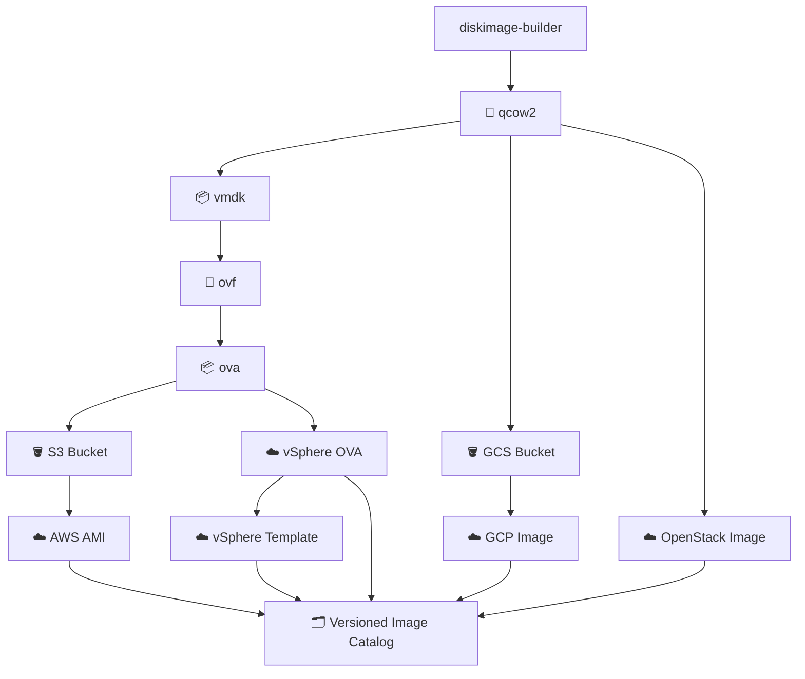

# DIB7 - Disk Image Builder

[](LICENSE)
[](https://ansible.com/)

DIB7 is an automated pipeline for building and deploying virtual machine disk
images across multiple cloud platforms using Ansible and diskimage-builder (DIB).

## Overview

DIB7 streamlines the entire lifecycle of VM image creation and deployment:

- **Build**: Create base QCOW2 images using diskimage-builder
- **Convert**: Transform images to platform-specific formats (OVA)
- **Deploy**: Import and publish images to AWS, GCP, OpenStack and VMware vSphere

## Architecture


```mermaid
flowchart TB
    DIB["diskimage-builder"] --> QCOW2["💽 qcow2"]
    QCOW2 --> VMDK["📦 vmdk"]
    VMDK --> OVF["📄 ovf"]
    OVF --> OVA["📦 ova"]
    QCOW2 --> GCS["🪣 GCS Bucket"]
    GCS --> GCP_IMG["☁️ GCP Image"]
    QCOW2 --> OPENSTACK_IMG["☁️ OpenStack Image"]
    OVA --> S3["🪣 S3 Bucket"]
    S3 --> AWS_IMG["☁️ AWS AMI"]
    OVA --> VSPHERE_IMG["☁️ vSphere OVA"]
    VSPHERE_IMG --> VSPHERE_TPL["☁️ vSphere Template"]
    AWS_IMG --> CATALOG["🗂️ Versioned Image Catalog"]
    GCP_IMG --> CATALOG
    OPENSTACK_IMG --> CATALOG
    VSPHERE_IMG --> CATALOG
    VSPHERE_TPL --> CATALOG
```

## Supported Platforms

### Cloud Providers

- **AWS** - AMI import via S3 and VM Import/Export
- **GCP** - Compute Engine images via Cloud Storage (GCS)
- **OpenStack** - Glance images via direct upload
- **VMware vSphere** - Content Library OVA deployment and vSphere template creation

### Operating Systems by Provider

Provider support is separate from DIB7 inventory support: a distro can be built
here and still not be importable by every provider. Re-check the provider matrix
before enabling a new target release. The per-release matrices, the DIB7 target
coverage tables, and known issues live in `doc/` - the links below are the
canonical copies, so add detail there rather than here:

- **AWS VM Import/Export** -
  [doc/aws-supported-images.md](doc/aws-supported-images.md)
- **GCP Compute Engine** (Migrate to Virtual Machines) -
  [doc/gcp-supported-images.md](doc/gcp-supported-images.md)
- **OpenStack Glance** - no provider-wide OS version list. Glance stores and
  serves bootable disk images; guest support depends on the cloud operator, the
  Nova hypervisor, image metadata, and local policy. DIB7 uploads QCOW2 images
  directly, so validate each target against the destination cloud's image policy
  and compute driver.
- **VMware vSphere** - DIB7 can deploy OVA files and create templates, but this
  repository does not maintain a vendor-backed per-release guest OS matrix.
  Newer targets may need the closest supported `vm_os_type` guest ID until the
  VMware/Broadcom compatibility documentation exposes an exact identifier.

The OpenStack and vSphere notes above have no separate page under `doc/`, so they
are the only copy.

### Configured DIB7 Operating System Targets

- CentOS Stream 10
- Debian 12 (Bookworm)
- Debian 13 (Trixie)
- Fedora 44
- Rocky Linux 10
- Ubuntu 24.04 LTS (Noble)
- Ubuntu 26.04 LTS (Resolute)

### Upstream diskimage-builder Operating System Elements

- Debian
- Ubuntu
- Fedora
- Red Hat Enterprise Linux (RHEL)
- CentOS
- Gentoo

The import playbooks publish provider-specific artifact IDs to a versioned image
catalog. See [doc/image-catalog.md](doc/image-catalog.md) for the Terraform
hand-off.

## Quick Start

### Prerequisites

1. **Python Environment**

   ansible-core 2.18 requires Python 3.11 or newer on the control node.

   ```bash
   sudo apt update
   sudo apt install -y python3 python3-venv python3-pip git
   python3 --version   # must report 3.11 or newer
   python3 -m venv ~/.dib7
   ```

   `~/.dib7` is the single virtualenv for the whole project — every distro
   builds from it. See
   [doc/python3-virtualenv.md](doc/python3-virtualenv.md).

2. **Pinned Ansible/Python Dependencies**

   ```bash
   ~/.dib7/bin/python3 -m pip install -r requirements.txt
   ~/.dib7/bin/ansible-galaxy collection install -r requirements.yml
   ```

   Install via `~/.dib7/bin/python3 -m pip` rather than `~/.dib7/bin/pip` — the
   interpreter path is what activates the venv and sets the shebangs on the
   installed console scripts.

   Fedora builds need an installed DIB element that supports Fedora's
   Generic cloud-image naming. If the installed DIB does not include that fix,
   apply the repository patch from the project root:

   <!-- markdownlint-disable MD013 -->

   ```bash
   DIB7_SITE=$(~/.dib7/bin/python3 -c "import site; print(site.getsitepackages()[0])")
   patch -b -d "$DIB7_SITE/diskimage_builder/elements/fedora/root.d" \
         < patches/diskimage-builder-fedora-generic-image.patch
   ```

   <!-- markdownlint-enable MD013 -->

   The validation gate checks the installed element and accepts either an
   upstream fix or this patch. The patch touches only the `fedora` element, so
   it is inert for the other builds sharing the venv. See
   [doc/fedora.md](doc/fedora.md).

   CentOS Stream 10 builds need the corresponding fix for CentOS's new
   GenericCloud filename convention. Apply it from the project root:

   ```bash
   patch -b -d "$DIB7_SITE/diskimage_builder/elements/centos/root.d" \
         < patches/diskimage-builder-centos10-generic-image.patch
   ```

   This patch is specific to `10-stream` and is inert for other CentOS
   releases. See [doc/centos.md](doc/centos.md). Reapply it after upgrading
   `diskimage-builder` unless the installed element has gained the upstream
   fix.

   `requirements.txt` includes `diskimage-builder`, `ansible-core`, `PyYAML`,
   and the controller-side Python SDKs required by the AWS, GCP, and
   OpenStack playbooks. The project is validated with ansible-core 2.18.18.
   Keep the collection versions in `requirements.yml` aligned with that core
   version — `amazon.aws` 11.x in particular requires ansible-core 2.17 or
   newer.

3. **System Dependencies**

   ```bash
   sudo apt install -y qemu-utils kpartx debootstrap parted dosfstools \
       gdisk squashfs-tools libguestfs-tools lvm2
   ```

   `ovftool` (tested with 5.1.0), PowerShell with PowerCLI, and the
   Google Cloud CLI (`gcloud`) are installed separately and are required by the
   conversion, vSphere, and GCP workflows respectively. See the playbook
   dependency list below.

### Basic Usage

For a multi-stage run, create one run ID and pass it to every stage so the
stamp gates can detect artifacts left by an earlier run:

```bash
RUN_ID=$(date +%s)
~/.dib7/bin/ansible-playbook -e "run_id=$RUN_ID" playbooks/build-qcow2.yml
~/.dib7/bin/ansible-playbook -e "run_id=$RUN_ID" playbooks/convert-qcow2-to-ova.yml
```

A manually driven stage without `run_id` still requires the preceding stamp and
uses the run recorded in that stamp for catalog versioning. The commands below
assume `RUN_ID` remains set; include `-e "run_id=$RUN_ID"` on each build,
conversion, and import invocation. A manually driven invocation can nevertheless
consume an older artifact if that old stamp remains, so use one run ID for a
release pipeline.

1. **Configure Vaults** (see [Vault Configuration](#vault-configuration))

2. **Build Base Image**

   ```bash
   # Build all hosts in the inventory
   ~/.dib7/bin/ansible-playbook playbooks/build-qcow2.yml \
     -e "run_id=$RUN_ID"

   # Build a specific host
   ~/.dib7/bin/ansible-playbook playbooks/build-qcow2.yml \
     -e "run_id=$RUN_ID" -l ubuntu24045

   # Build all hosts in a group
   ~/.dib7/bin/ansible-playbook playbooks/build-qcow2.yml \
     -e "run_id=$RUN_ID" -l ubuntu
   ```

   Omit `-l` to run against every host in `hosts.yml`. Use `-l` only when you
   want to limit the run to a specific host or inventory group.

3. **Deploy to Target Platform**

   **AWS:**

   ```bash
   ~/.dib7/bin/ansible-playbook playbooks/convert-qcow2-to-ova.yml \
     -e "run_id=$RUN_ID" -l <host-or-group> --ask-vault-pass
   ~/.dib7/bin/ansible-playbook playbooks/import-ova-aws.yml \
     -e "run_id=$RUN_ID" -l <host-or-group> --ask-vault-pass
   ```

   **GCP:**

   ```bash
   ~/.dib7/bin/ansible-playbook playbooks/import-qcow2-gcp.yml \
     -e "run_id=$RUN_ID" -l <host-or-group> --ask-vault-pass
   ```

   **OpenStack:**

   ```bash
   ~/.dib7/bin/ansible-playbook playbooks/import-qcow2-openstack.yml \
     -e "run_id=$RUN_ID" -l <host-or-group> --ask-vault-pass
   ```

   **vSphere:**

   `import-ova-vsphere.yml` and `import-ova-vsphere-template.yml` are
   alternatives, not a chain — each independently uploads the OVA, so only run
   the one(s) you actually need.

   ```bash
   # vSphere OVA (content library item) only
   ~/.dib7/bin/ansible-playbook playbooks/convert-qcow2-to-ova.yml \
     -e "run_id=$RUN_ID" -l <host-or-group> --ask-vault-pass
   ~/.dib7/bin/ansible-playbook playbooks/import-ova-vsphere.yml \
     -e "run_id=$RUN_ID" -l <host-or-group> --ask-vault-pass

   # vSphere Template instead
   ~/.dib7/bin/ansible-playbook playbooks/convert-qcow2-to-ova.yml \
     -e "run_id=$RUN_ID" -l <host-or-group> --ask-vault-pass
   ~/.dib7/bin/ansible-playbook playbooks/import-ova-vsphere-template.yml \
     -e "run_id=$RUN_ID" -l <host-or-group> --ask-vault-pass
   ```

## Project Structure

```bash
dib7/
├── ansible.cfg                  # Ansible configuration
├── bin/                         # Utility scripts
│   ├── import-ova-vsphere.ps1   # PowerShell vSphere import script
│   ├── import-ova-vsphere-template.ps1  # PowerShell template import script
│   ├── publish-image-catalog.py # Catalog publisher
│   ├── reconcile-catalog-aws.py # Removes catalog AMIs gone from AWS
│   ├── reconcile-catalog-gcp.py # Removes catalog images gone from GCP
│   ├── reconcile-catalog-openstack.py # Removes catalog images gone from OpenStack
│   ├── inspect-qcow2.sh         # Script for examining and modifying virtual machines
│   └── *-vault.sh               # Vault management scripts
├── block-device-config/         # DIB EFI/GPT block-device layouts
├── catalogs/                    # Versioned provider artifact catalog and schema
├── doc/                         # Documentation
├── elements/                    # DIB elements for custom OS configurations
├── group_vars/                  # Ansible group variables
├── hosts.yml                    # Inventory file
├── patches/                     # Patches applied to the venv (see doc/fedora.md and doc/centos.md)
├── playbooks/                   # Ansible playbooks
├── requirements.txt             # Pinned Python dependencies
├── requirements.yml             # Pinned Ansible collections
├── templates/                   # Jinja2 templates
├── tests/                       # Syntax and data validation
└── vaults/                      # Encrypted credentials
```

## Documentation

- `doc/adding-distros-and-releases.md` - how to add a new distro family or a
  new version of an existing distro
- `doc/ansible-galaxy.md` - installing and verifying the Ansible Galaxy
  collections used by DIB7
- `doc/aws-supported-images.md` - AWS VM Import/Export Linux distribution support
- `doc/centos.md` - CentOS Stream 10 cloud-image compatibility and patching
- [DIB7 contact sheet](doc/dib7-contact-sheet.png) - visual overview of the project and image pipeline
- [DIB7 presentation](doc/dib7-presentation.pptx) - project presentation slides
- `doc/fedora.md` - Fedora Server 43+ diskimage-builder compatibility and patch
- `doc/gcloud.md` - installing the Google Cloud CLI (`gcloud`)
- `doc/gcp-supported-images.md` - GCP Compute Engine Linux distribution support
- `doc/group-vars-all.md` - defaults shared by all builds
- `doc/group-vars-distro.md` - per-distro variables and differences
- `doc/image-catalog.md` - catalog format, reconciliation, and Terraform hand-off contract
- `doc/phases.md` - DIB phase subdirectories, execution order, and chroot behavior
- `doc/playbooks-overview.md` - what each playbook does and when to run it
- `doc/python3-virtualenv.md` - setting up the diskimage-builder Python
  virtual environment
- `doc/vaults.md` - vault file layout required by each playbook

## Playbooks

- `build-qcow2.yml`: Build base QCOW2 image.
  Dependencies: diskimage-builder.
- `convert-qcow2-to-ova.yml`: Convert QCOW2 to OVA.
  Dependencies: qemu-img and ovftool (tested with 5.1.0).
- `import-ova-aws.yml`: Upload OVA to S3, import to AWS AMI.
  Dependencies: `amazon.aws` collection, S3, VM Import.
  For direct playbook calls, pass `-e aws_target_project=<target>`;
  the target may be a vault key or account ID. The `local/` shell wrappers instead
  accept the environment variable `AWS_TARGET_PROJECT`.
- `import-ova-vsphere.yml`: Import OVA to vSphere content library.
  This produces the `vSphere OVA` branch in the workflow.
  Dependencies: pwsh, PowerCLI.
- `recreate-vsphere-template.yml`: Recreate a vSphere template from an OVA
  already in the content library; no local upload is required.
  Dependencies: pwsh, PowerCLI.
- `import-ova-vsphere-template.yml`: Import the vSphere OVA and create
  a vSphere template in `Templates`.
  Dependencies: pwsh, PowerCLI.
- `import-qcow2-gcp.yml`: Import QCOW2 to GCP. Always re-uploads the QCOW2
  to GCS, and by default deletes and replaces any existing Compute image of
  the same name (see `gcp_replace_existing_image`).
  Dependencies: gcloud (including `gcloud storage`).
  For direct playbook calls, pass `-e gcp_target_project=<target>`;
  the target may be a vault key or project ID. The `local/` shell wrappers instead
  accept the environment variable `GCP_TARGET_PROJECT`.
- `import-qcow2-openstack.yml`: Import QCOW2 to OpenStack.
  Dependencies: `openstack.cloud` collection.
  For direct playbook calls, pass `-e openstack_target_project=<target>`;
  the target may be a vault key, project name, or project ID. The `local/` shell wrappers instead
  accept the environment variable `OPENSTACK_TARGET_PROJECT`.
- `backfill-vsphere-ova-catalog.yml`: Rebuild missing vSphere OVA catalog rows
  for artifacts already imported into the content library.

## Vault Configuration

DIB7 uses Ansible Vault for secure credential management. Create encrypted
vault files:

### AWS Vault (`vaults/aws.yml`)

```yaml
aws_projects:
  "123456789012":
    aws_account_id: "123456789012"
    aws_region: "my-region"
    s3_bucket: "my-bucket"
    vmimport_role_name: "vmimport-role"
    # Optional profile or access-key fields.
```

Select one AWS account with `-e aws_target_project=<key-or-account-id>`; a
single-entry map is selected automatically. A legacy flat mapping remains
supported for one account.

### GCP Vault (`vaults/gcp.yml`)

```yaml
gcp_projects:
  my-project:
    gcp_project: "my-project"
    gcs_bucket: "my-image-bucket"
    # Region that runs the import job, not a bucket or image location.
    # See doc/vaults.md.
    gcp_import_location: "us-central1"
    service_account_key: |
      {
        "type": "service_account",
        ...
      }
```

Select one GCP project with `-e gcp_target_project=<key-or-project-id>`; a
single-entry map is selected automatically. A legacy flat mapping remains
supported for one project.

### OpenStack Vault (`vaults/openstack.yml`)

```yaml
openstack_projects:
  my-project-a:
    auth_url: "https://keystone.example.com:5000/v3"
    username: "my-username"
    password: "my-password"
    project_name: "my-project-a"
    project_id: "project-id-a"
    region_name: "my-region"
    user_domain_name: "Default"
    project_domain_name: "Default"
  my-project-b:
    auth_url: "https://keystone.example.com:5000/v3"
    username: "my-username"
    password: "my-password"
    project_name: "my-project-b"
    project_id: "project-id-b"
    region_name: "my-region"
    user_domain_name: "Default"
    project_domain_name: "Default"

# A legacy single-project openstack_auth mapping remains supported.
```

### vSphere Vault (`vaults/vsphere.yml`)

`vsphere_projects`, a mapping of vCenter key to a vCenter entry:
`vcenter_hostname`, `vcenter_username`, `vcenter_password`, optional
`datacenter` (falls back to `"Datacenter"`), and optional `validate_certs`
(default `true`). One run targets one vCenter, selected with
`-e vsphere_target_vcenter=<key-or-hostname>`; the selector
(`playbooks/tasks/select-vcenter.yml`) matches a vault key or a
`vcenter_hostname`, auto-selects a single-entry map, and fails loud listing
available keys. A legacy vault holding only the flat
`vcenter_hostname`/`vcenter_username`/`vcenter_password` still works
unmodified: with no explicit `-e vsphere_target_vcenter` the legacy
credentials are used as-is even when `vsphere_projects` is also present (the
same rule as `openstack_projects` in `vaults/openstack.yml`).

```yaml
vsphere_projects:
  example:
    vcenter_hostname: "vc.example.com"
    vcenter_username: "administrator@example.com"
    vcenter_password: "secure-password"
    datacenter: "Datacenter"
    validate_certs: false
  other-site:
    vcenter_hostname: "vc.other.example.com"
    vcenter_username: "administrator@other.example.com"
    vcenter_password: "other-secure-password"
    datacenter: "Other-DC"
    validate_certs: true

# A legacy single-vCenter flat vcenter_hostname/vcenter_username/
# vcenter_password block remains supported.
```

The selector is byte-identical to migrate-vmware's (the source of truth for
this logic) apart from its file path, and also derives the `GOVC_URL` /
`GOVC_USERNAME` / `GOVC_PASSWORD` / `GOVC_INSECURE` and lowercase `govc_*`
variables that repo's govc/ovftool tasks consume. Nothing in this repo reads
them today; they are kept for parity so the two selectors stay in lockstep.

The template playbook also uses these non-secret variables (site defaults in
`group_vars/all/main.yml`):

```yaml
vsphere_content_library: "my-content-library"
vsphere_template_name: "inventory-item-base.tmpl"
```

## Default Image Users

Each custom element creates one bootstrap account for console or password-based
SSH access: the distro's own name (`ubuntu`, `debian`, `fedora`, `rocky`), except
CentOS Stream, which uses `cloud-user`. The temporary password is the account
name in every case, `root`/`root` also works, and each account has passwordless
sudo.

These passwords are predictable on purpose and are meant for test environments
only: replace them with SSH keys and disable password authentication before using
an image anywhere else.

The account names come from each element's `post-install.d/20-useradd`, which is
the source of truth if this list and an image ever disagree.

## Custom Elements

DIB7 includes custom diskimage-builder elements for supported operating systems:

- `elements/custom-centos/` - CentOS Stream 10 customizations
- `elements/custom-debian/` - Debian customizations
- `elements/custom-fedora/` - Fedora customizations
- `elements/custom-rocky/` - Rocky Linux customizations
- `elements/custom-ubuntu/` - Ubuntu customizations

DIB7 also carries one base OS element of its own, because diskimage-builder
does not ship a cloud-image element for it:

- `elements/rocky-cloud-image/` - fetches a Rocky Linux cloud image, modelled on
  the upstream `centos` element. See
  [elements/rocky-cloud-image/README.rst](elements/rocky-cloud-image/README.rst).

Each element directory can contain standard diskimage-builder phase
subdirectories. Common phases include:

- `pre-install.d/` - Pre-installation setup
- `install.d/` - Package installation
- `post-install.d/` - Post-installation configuration
- `finalise.d/` - Image finalization

See [doc/phases.md](doc/phases.md) for the complete ordered list of DIB phases
and whether each phase runs inside or outside the chroot.

## Variables

The defaults live in [`group_vars/all/main.yml`](group_vars/all/main.yml). The two
pages below document them and are the canonical reference - add or change
documentation there rather than here:

- [doc/group-vars-all.md](doc/group-vars-all.md) - every global default, including
  the distro-independent DIB inputs, VM sizing, swap, and the catalog and stamp
  contract
- [doc/group-vars-distro.md](doc/group-vars-distro.md) - what each
  `group_vars/<distro>/main.yml` sets, and how the five distros differ

## Development

### Testing Image Builds

```bash
# Test basic DIB functionality
export DIB_RELEASE=noble
~/.dib7/bin/disk-image-create ubuntu vm -o test-ubuntu

# Inspect QCOW2 contents
./bin/inspect-qcow2.sh -i test-ubuntu.qcow2
```

### Adding New OS Support

1. Add the host and `dib_release` to the appropriate group in `hosts.yml`
2. Create or update the distro variables in `group_vars/`
3. Create or update the custom element in `elements/`
4. Update documentation in `doc/`

For a full walkthrough, including how to add a new release of an existing
distro such as Ubuntu `26.04`, see
`doc/adding-distros-and-releases.md`.

## Validation

Run the local validation suite before committing changes:

```bash
./tests/validate.sh
```

This checks every actual playbook with Ansible syntax validation, verifies the
pinned Ansible collections and the Fedora and CentOS Stream 10 DIB
compatibility, validates the catalog schema, parses non-secret YAML and
PowerShell, runs `bash -n` against the shell helpers, compiles the Python
utilities with `py_compile`, and runs the catalog tests in
`tests/test_catalog.py` plus the Ansible and PowerShell regressions in
`tests/test_pipeline.py`. These regressions use temporary files and mocked
cloud tools. Live cloud imports require provider credentials and are not
executed by the local suite.

## Troubleshooting

### Common Issues

1. **DIB Build Failures**
   - Ensure all system dependencies are installed
   - Check available disk space (>50GB recommended)
   - Verify Python virtual environment is activated

2. **Stamp-gate Failures**
   - If a stage says an artifact did not complete for the current host, inspect
     the preceding stage log and its `.built`/`.converted` stamp. Do not bypass
     the gate by reusing an artifact from an older run; rerun the failed stage
     with one shared `run_id`.

3. **Cloud Import Failures**
   - Validate vault credentials
   - Check cloud provider quotas and permissions
   - Review cloud provider import logs
   - AWS imports are meant only for the inventory's `aws_import` group; limit
     the AWS stage with `-l aws_import` rather than attempting every distro.
   - GCP: reruns delete and replace any existing Compute image with the same
     name by default (`gcp_replace_existing_image: true`); set it to `false`
     first if you need to keep the existing image

4. **Ansible Collection Issues**
   - Update collections: `~/.dib7/bin/ansible-galaxy collection install --force`
     `<collection>`
   - Check collection compatibility with Ansible version

### Debug Mode

Run playbooks with verbose output:

```bash
~/.dib7/bin/ansible-playbook -e "run_id=$RUN_ID" playbooks/build-qcow2.yml -vvv
```

## Contributing

1. Fork the repository
2. Create a feature branch
3. Make changes with proper documentation
4. Test thoroughly across all supported platforms
5. Submit a pull request

## License

This project is licensed under the MIT License - see the LICENSE file for details.

## Support

For issues and questions:

- Check existing documentation in `doc/`
- Review Ansible playbook logs
- Validate cloud provider service status
- Create an issue with detailed error logs and configuration
