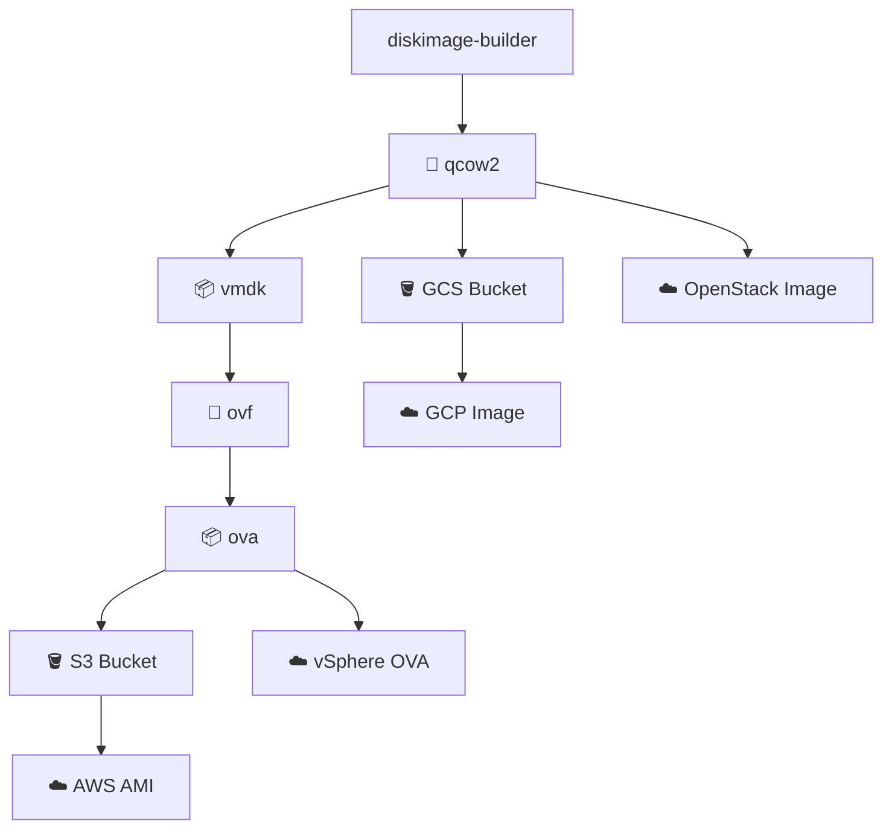

# Workflow

<!-- markdownlint-disable MD013 -->

```mermaid
flowchart TB
    DIB["diskimage-builder"] --> QCOW2["💽 qcow2"]
    QCOW2 --> VMDK["📦 vmdk"]
    VMDK --> OVF["📄 ovf"]
    OVF --> OVA["📦 ova"]
    QCOW2 --> GCS["🪣 GCS Bucket"]
    GCS --> GCP_IMG["☁️ GCP Image"]
    QCOW2 --> OPENSTACK_IMG["☁️ OpenStack Image"]
    OVA --> S3["🪣 S3 Bucket"]
    S3 --> AWS_IMG["☁️ AWS AMI"]
    OVA --> VSPHERE_IMG["☁️ vSphere OVA"]
```
