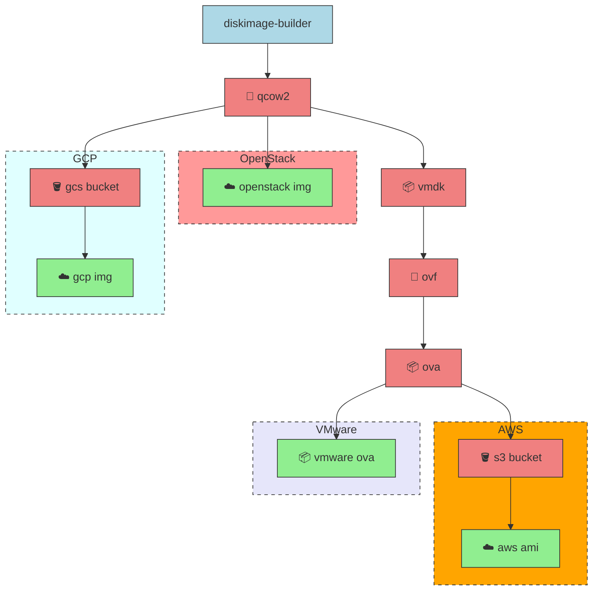

# Workflow

<!-- markdownlint-disable MD013 -->

```mermaid
flowchart TB

    %% Core component
    DIB["diskimage-builder"]
    QCOW2["💽 qcow2"]

    DIB --> QCOW2

    %% Intermediate formats (generic)
    VMDK["📦 vmdk"]
    OVF["📄 ovf"]
    OVA["📦 ova"]

    QCOW2 --> VMDK
    VMDK --> OVF
    OVF --> OVA

    %% OpenStack (red log)
    subgraph OpenStack["OpenStack"]
        style OpenStack fill:#ff9999,stroke:#333,stroke-width:1px,stroke-dasharray: 5
        OS_IMG["☁️ openstack img"]
    end
    QCOW2 --> OS_IMG

    %% GCP (light cyan)
    subgraph GCP["GCP"]
        style GCP fill:#e0ffff,stroke:#333,stroke-width:1px,stroke-dasharray: 5
        GCS["🪣 gcs bucket"]
        GCP_IMG["☁️ gcp img"]
        GCS --> GCP_IMG
    end
    QCOW2 --> GCS

    %% AWS (orange)
    subgraph AWS["AWS"]
        direction TB
        style AWS fill:#ffa500,stroke:#333,stroke-width:1px,stroke-dasharray: 5
        S3["🪣 s3 bucket"]
        AWS_IMG["☁️ aws ami"]
        S3 --> AWS_IMG
    end

    OVA --> S3

    %% VMware (lavender)
    subgraph VMware["VMware"]
        style VMware fill:#e6e6fa,stroke:#333,stroke-width:1px,stroke-dasharray: 5
        VM_OVA["📦 vmware ova"]
    end
    OVA --> VM_OVA

    %% === Color classes for nodes ===
    classDef core fill:#add8e6,stroke:#333,stroke-width:1px;        %% LightBlue
    classDef intermediate fill:#f08080,stroke:#333,stroke-width:1px; %% LightCoral
    classDef cloud fill:#90ee90,stroke:#333,stroke-width:1px;       %% fallback for cloud nodes

    class DIB core;
    class QCOW2 intermediate;
    class VMDK,OVF,OVA intermediate;
    class GCS,S3 intermediate;
    class OS_IMG,GCP_IMG,AWS_IMG,VM_OVA cloud;

```
