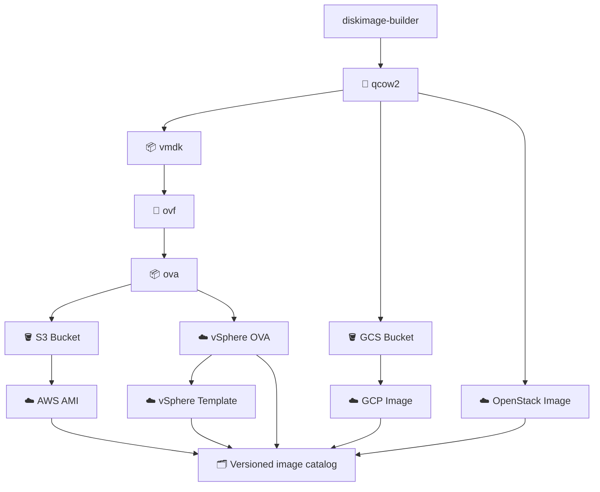

# Workflow

<!-- markdownlint-disable MD013 -->

Each import writes its provider artifact ID to
`catalogs/image-catalog.json`. The build and conversion stages write provenance
stamps alongside their artifacts; downstream stages require those stamps before
they consume a QCOW2 or OVA. See `local/pipeline-stamps.md` (internal-only,
not part of the public dib7 mirror) and [image-catalog.md](image-catalog.md).
